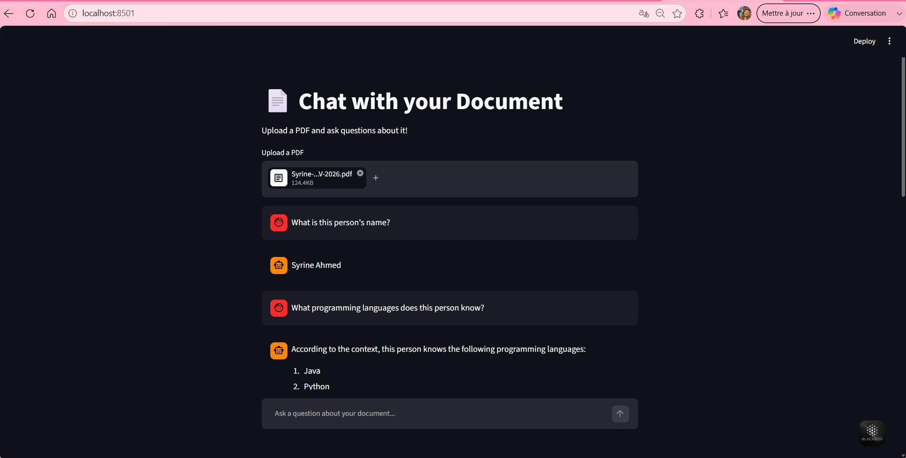

# 📄 Document Chat (RAG)

Chat with any PDF document using AI. Upload a document and ask questions — the AI answers based on the actual content using RAG (Retrieval Augmented Generation).

## Features
- 📄 Upload any PDF
- 🔍 AI searches the document for relevant content
- 💬 Ask questions and get accurate, document-based answers
- 🧠 Built with real RAG architecture (chunking, embeddings, vector search)

## Built with
- Python
- Groq API (LLaMA 3.3)
- LangChain (text splitting)
- ChromaDB (vector database)
- HuggingFace Embeddings (sentence-transformers)
- Streamlit
- PyMuPDF

## How it works
1. PDF is split into chunks
2. Each chunk is converted to embeddings (numerical representation)
3. Embeddings stored in a vector database
4. User question is matched against chunks using similarity search
5. Most relevant chunks are sent to the AI as context
6. AI answers based only on that context

## How to run
1. Clone the repo
2. Install: `pip install -r requirements.txt`
3. Add `GROQ_API_KEY` to `.env`
4. Run: `streamlit run app.py`

## Author
Syrine Ahmed — [GitHub](https://github.com/syrineahmed)

## Preview
